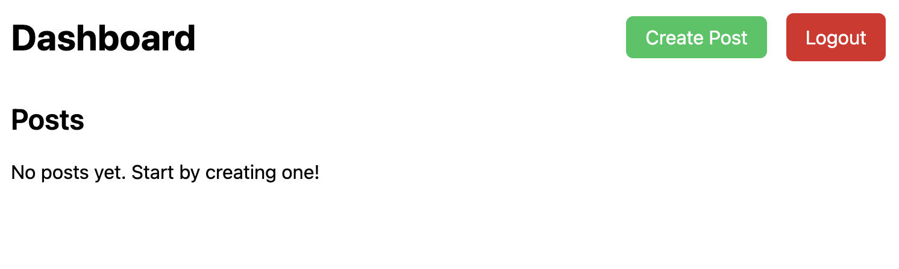
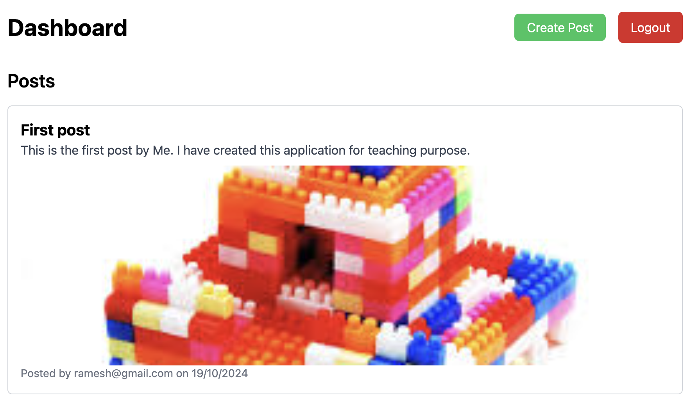
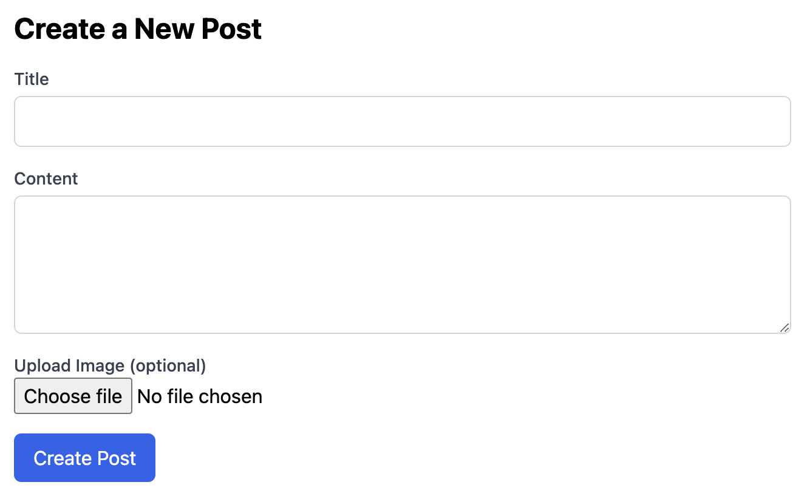
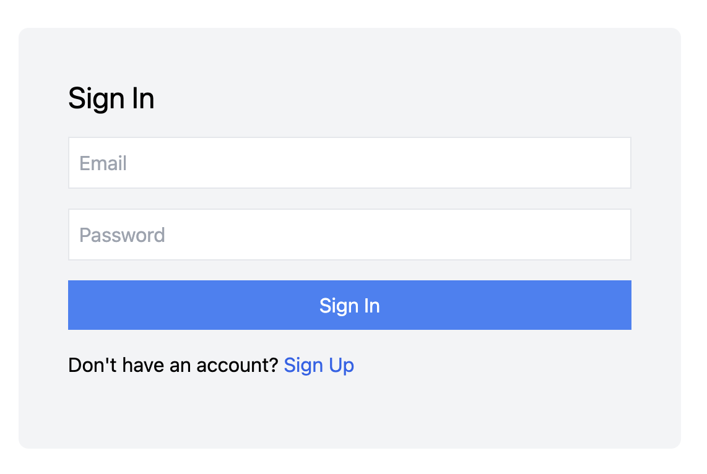
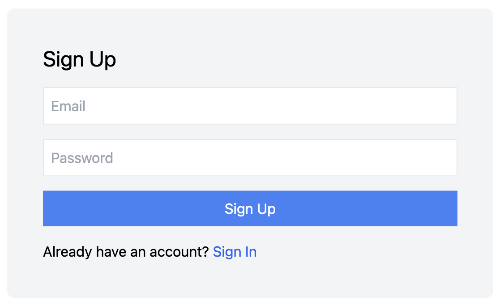

# 🚀 Social Dashboard Web App

A beautifully crafted **Facebook-like Dashboard** built with modern web technologies. This project allows users to **sign up**, **sign in**, and **create posts** with title, content, and optional images. Authenticated users can access the dashboard and create/view posts in real-time using **Firebase Realtime Database** and **Firebase Storage**.

## 🌟 Features

- **User Authentication**: Secure sign-up and sign-in using Firebase Authentication.
- **Protected Routes**: Only authenticated users can access the dashboard and create posts. Non-authenticated users are redirected to the sign-in page using a **Private Route** component.
- **Create Posts**: Authenticated users can create posts with a title, content, and optionally, an image.
- **Realtime Post Feed**: Posts are dynamically fetched from Firebase Realtime Database, showing the most recent posts immediately.
- **Image Upload**: Store post images in Firebase Storage and display them in the posts feed.
- **Navigation**: Intuitive navigation between the sign-up, sign-in, and dashboard pages using **React Router DOM**.
- **Environment Variables**: Sensitive data like Firebase keys are stored in a `.env` file, ensuring secure access to Firebase services.
- **Context API**: Used to manage authentication state and user details across the app.

## 🛠️ Tech Stack

- **Frontend**:

  - [React.js](https://reactjs.org/) with [Vite](https://vitejs.dev/) for fast development.
  - [React Router DOM](https://reactrouter.com/) for navigation.
  - [Tailwind CSS](https://tailwindcss.com/) for modern, responsive styling.

- **Backend**:
  - [Firebase Authentication](https://firebase.google.com/products/auth) for user management.
  - [Firebase Realtime Database](https://firebase.google.com/products/realtime-database) for storing and retrieving posts in real-time.
  - [Firebase Storage](https://firebase.google.com/products/storage) for handling image uploads.

## 📸 Screenshots

**Empty Dashboard**  


**Dashboard With Posts**  


**Create Post**  


**Sign In/Sign Up**  




## 🚀 Getting Started

Follow these steps to set up and run the project locally.

### 1. Clone the repository:

```bash
git clone https://github.com/subraatakumar/subrata-social-app your-app-name
cd your-app-name
```

### 2. Install Dependencies

```bash
npm install
```

### 3. Set up Firebase:

1. Go to [Firebase Console](https://console.firebase.google.com/).
2. Create a new project and enable **Firebase Authentication**, **Firebase Realtime Database**, and **Firebase Storage**.
3. In your Firebase project settings, generate Firebase configuration keys.
4. Create a `.env` file in the root of your project and add the following Firebase configuration variables:

```env
VITE_FIREBASE_API_KEY=your_api_key
VITE_FIREBASE_AUTH_DOMAIN=your_auth_domain
VITE_FIREBASE_PROJECT_ID=your_project_id
VITE_FIREBASE_STORAGE_BUCKET=your_storage_bucket
VITE_FIREBASE_MESSAGING_SENDER_ID=your_messaging_sender_id
VITE_FIREBASE_APP_ID=your_app_id
VITE_FIREBASE_DATABASE_URL=your_database_url
```

Note: Keep your `.env` file out of version control (add it to `.gitignore`) to prevent exposing sensitive data.

### 4. Start the development server:

```bash
npm run dev
```

The app should now be running on `http://localhost:3000.`

## 🔧 Project Structure

```graphql
src/
│
├── components/         # Reusable components (e.g., Dashboard, CreatePost)
├── contexts/           # Context API logic for authentication
├── firebase.js         # Firebase configuration and initialization
├── pages/              # Individual pages (SignIn, SignUp, CreatePost, etc.)
├── utils/              # Utility functions, like private route logic
└── App.jsx             # Main app entry point with routing
```

## 🔑 Key Features Breakdown

1. Authentication (Firebase)
   Firebase Authentication is used to allow users to sign up and log in using their email and password.
   The authentication state is managed using Context API to provide access to user data throughout the app.
2. Environment Variables
   .env file is used to securely store Firebase configuration details, ensuring sensitive keys are not exposed in the codebase.
   Vite's environment variable support allows you to easily access these variables using import.meta.env.
3. Protected Routes
   The app uses PrivateRoute to protect the dashboard and other authenticated routes. If a user is not signed in, they are redirected to the Sign In page.

```jsx
// Example of PrivateRoute component
const PrivateRoute = ({ children }) => {
  const { user } = useContext(AuthContext);
  return user ? children : <Navigate to="/signin" />;
};
```

4. Create Post
   Users can create a post with a title, content, and optionally an image.
   Post images are uploaded to Firebase Storage, and the metadata (title, content, image URL) is stored in Firebase Realtime Database.
5. Realtime Updates
   The posts feed on the dashboard listens to changes in Firebase Realtime Database and updates in real-time, displaying posts as soon as they're created.

## Design Patterns / Best Practices used

```js
{loading ? 'Posting...' : 'Create Post'}
```

- This code snippet utilizes conditional rendering, a best practice in React for providing dynamic UI feedback based on state. By employing a ternary operator, it clearly distinguishes between loading and idle states, enhancing user experience. This approach aligns with the separation of concerns principle, allowing components to manage their own state effectively. Additionally, it demonstrates the composition pattern by integrating logic directly into JSX. Overall, it encourages clear, maintainable code while keeping the UI responsive.


## 🚀 Future Enhancements

- Like & Comment System: Allow users to interact with posts by liking and commenting.
- User Profiles: Create individual user profiles displaying user-specific posts and details.
- Enhanced Design: Add animations, transitions, and more modern UI components.

## 🤝 Contributing

Feel free to fork the project and submit a pull request if you'd like to improve or add features. Contributions are always welcome!

## 📝 License

This project is licensed under the MIT License. See the LICENSE file for more details.

## 🌟 Show your support!

If you like this project, please ⭐️ the repository to help others discover it! Happy coding! 🎉
